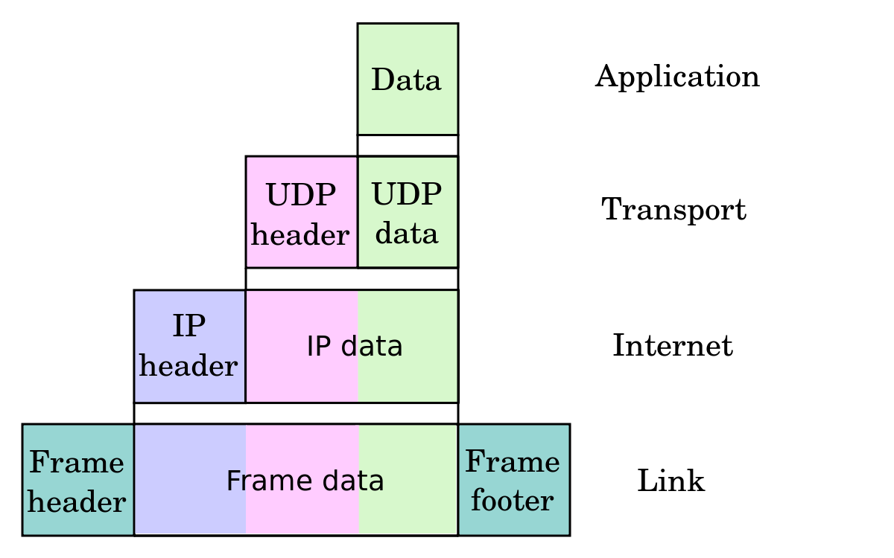
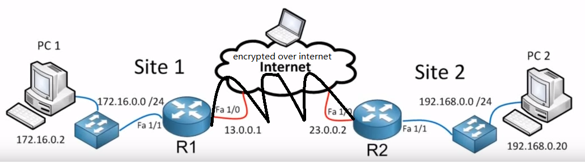

# IPSec

## Definition
* Data encapsulation in network, and encrypted over the internet, once it's get to the target the site, the data gets decrypted and transferred to target.

## Packet Structure
* Security in Network Layer, encrypt the IP data
    * IP Authentication header (ensure the authentication)

        | -- IP header -- | -- Authentication Header -- | -- TCP / UDP data -- | 
    * IP encapsulating security payload (ensure privacy and authentication)
    
        | -- IP header -- | -- ESP header -- | -- encrypted TCP / UDP data -- | -- ESP Trailer -- | -- ESP Auth -- |

## VPN 

