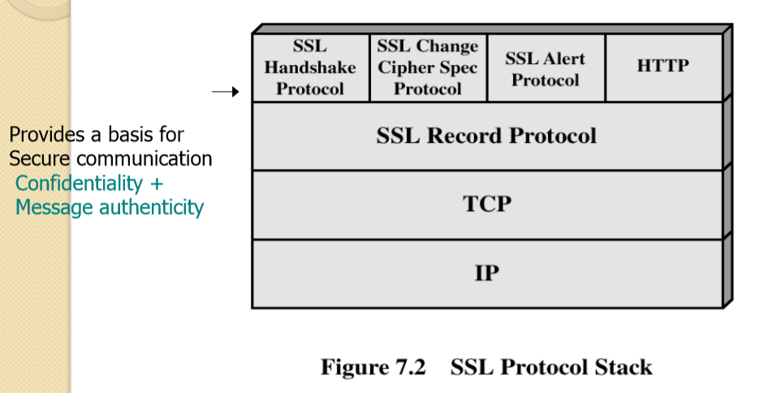
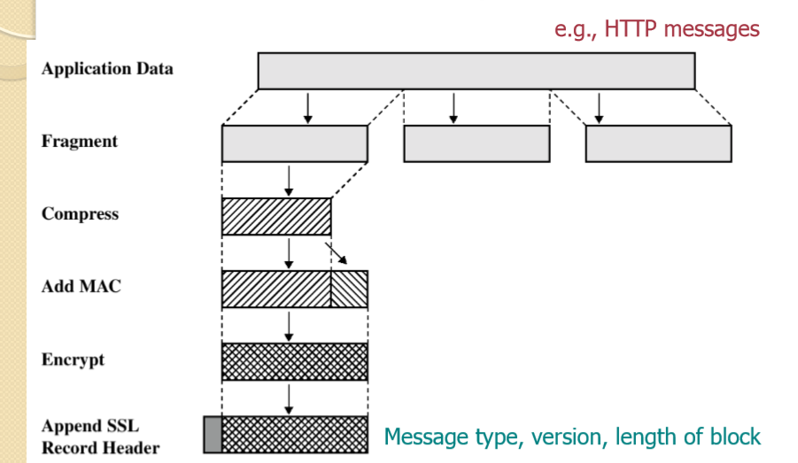
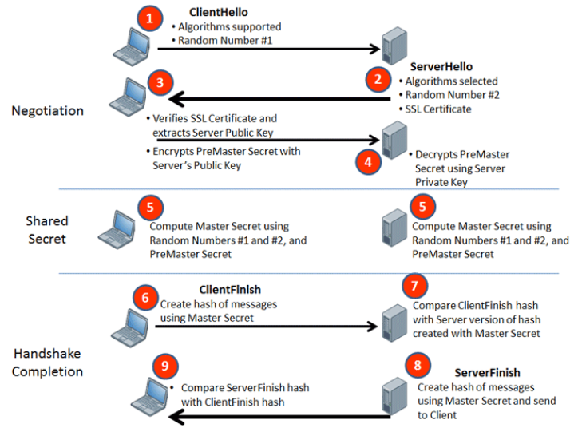

# SSLv3 (TLS)

## Definition
* Security on Transport layer, with compress and encryption, prevent the application data visible in the routing process

## Protocol Suit and Packet
* protocol stack

* form packet

    * In record header, there's some informaiton
        1. message type: handshake message / cipher spec message
        1. version
        1. block length

## Key Exchange 
* Diagram from net

* Diagram of my own understanding

## SSL VPN
* over application level, no need extra hardware
* data are encrypted until get to target, rather than site (compare with IPSec VPN)